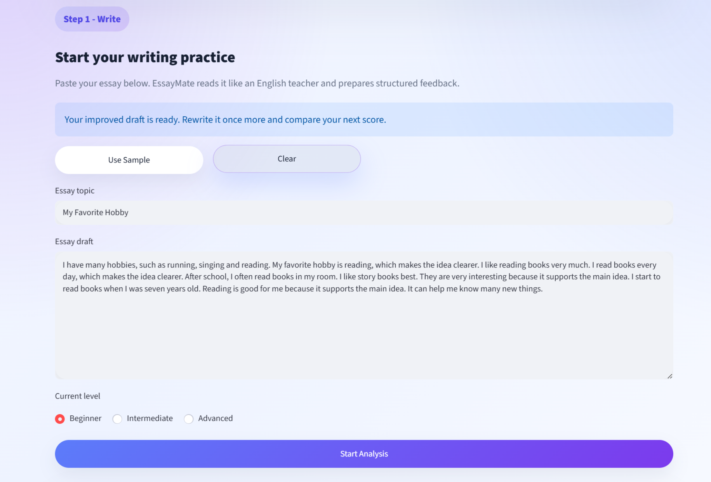
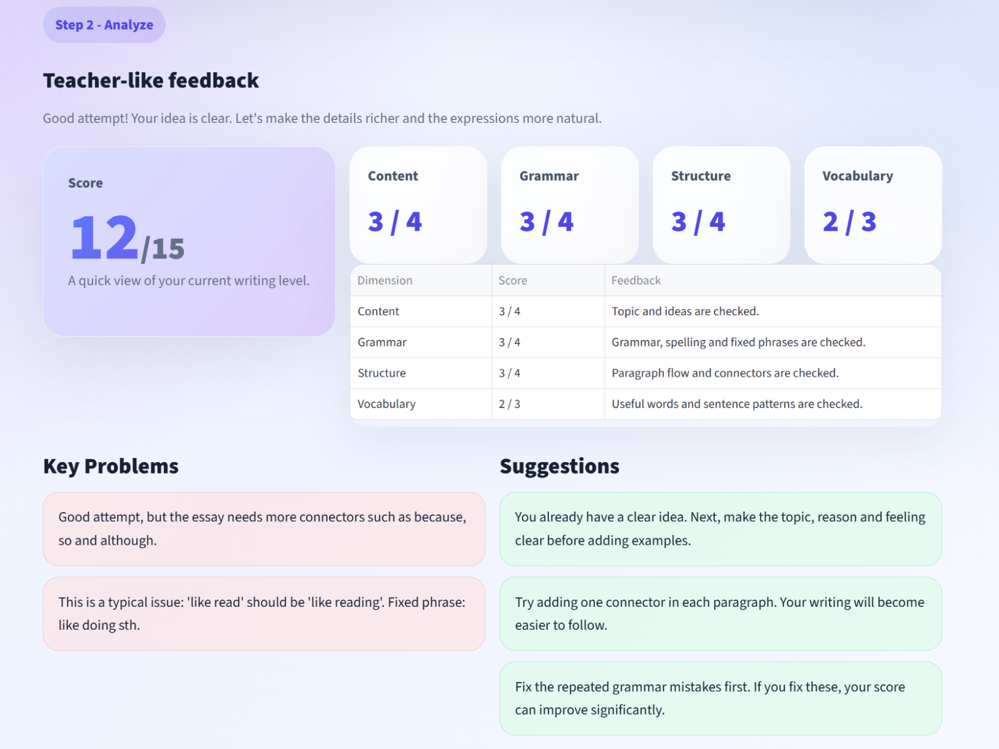
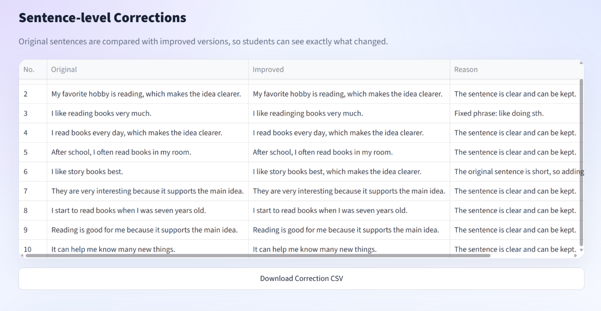
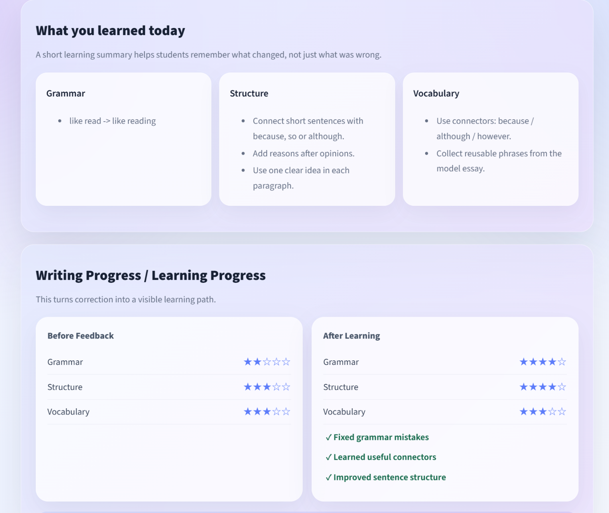

# EssayMate

## AI Writing Coach for Students

Feedback that becomes learning.

EssayMate turns English writing practice into a structured loop:

**Write -> Analyze -> Learn -> Retry -> Improve**

<br>



<br>

---

<br>

## Live Demo

Try EssayMate online:

[Open EssayMate Demo](https://essaymate-p4jdymd2qbyxf3kuwsbrk.streamlit.app)

No installation required.

<br>

---

<br>

## Why EssayMate

Students often receive scores.

But they do not always know what to fix next.

EssayMate is designed to make feedback visible, understandable and reusable.

Correction is not the end.

Learning starts there.

<br>

---

<br>

## The Problem

English writing feedback is often vague.

Students see grammar marks, but not a clear learning path.

Traditional correction is usually one-time.

EssayMate turns it into a continuous practice system.

<br>

---

<br>

## The Solution

A teacher-like AI writing coach.

It evaluates the essay, explains problems, improves sentences, generates learning materials and guides the student to rewrite.

<br>



<br>

---

<br>

## Core Features

AI writing score across four dimensions.

Sentence-level correction with explanations.

Key problems and actionable suggestions.

Model essay for imitation.

Key phrases for exam writing.

Learning progress and retry actions.

<br>

---

<br>

## Product Flow

### Write

Students submit an English essay.

### Analyze

EssayMate scores content, grammar, structure and vocabulary.

### Learn

Students review corrections, model essay and key phrases.

### Retry

Students rewrite the essay with clearer goals.

### Improve

Progress becomes visible through repeated practice.

<br>



<br>

---

<br>

## Learning Loop

Before feedback, students only see mistakes.

After learning, they know what they improved.

Grammar.

Structure.

Vocabulary.

Next practice.

<br>



<br>

---

<br>

## Technical Implementation

Streamlit for interactive UI.

Python for mock AI logic.

Rule-based scoring and feedback generation.

No database.

No login system.

No external API required.

<br>

---

<br>

## Local Setup

```bash
pip install -r requirements.txt
streamlit run app.py
```

Then open:

```text
http://localhost:8501
```

<br>

---

<br>

## Tech Stack

Streamlit / Python / Pandas / Mock AI Engine

<br>

---

<br>

## Built For

AI product internship portfolio.

AI education product design.

Streamlit AI application demo.
